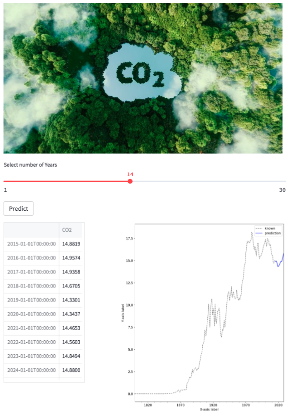

# EcoTrendPredictor

# CO2 Emission Forecasting Models

This project focuses on developing and comparing different time series models to forecast CO2 emissions for a car manufacturer. The goal is to assist the manufacturer in adhering to government regulations regarding climate change agreements. The dataset used for model development is an open-source dataset with two variables: Date and CO2 levels.

## Models Implemented

1. Single Exponential Smoothing (SES)
2. Double Exponential Smoothing (DES)
3. Triple Exponential Smoothing (TES)
4. Autoregressive Integrated Moving Average (ARIMA)
5. Long Short-Term Memory (LSTM) Neural Network

## Development Process

1. Data Preprocessing: The dataset is prepared by handling missing values, converting the Date variable into a proper format, and ensuring data quality.

2. Model Development: Each time series model is implemented and trained on the CO2 emissions dataset. The models learn the patterns and relationships within the data to make future predictions.

3. Model Evaluation: The Mean Squared Error (MSE) and Mean Absolute Error (MAE) metrics are calculated for each model. These metrics assess the accuracy of the models' predictions. The model with the lowest errors is selected as the final model.

4. Model Deployment: The chosen model is deployed using Streamlit, a Python library for creating interactive web applications. Users can interact with the application and select a range of years for which they want to predict CO2 levels.

## Usage

1. Install the required dependencies listed in the `requirements.txt` file.

2. Run the Streamlit application using the following command:
   !streamlit run co2_forecasting_app.py & npx localtunnel --port 8501
   
   This starts the Streamlit application and then uses localtunnel to make it accessible to others through a public URL
   
4. Access the application in your web browser at `http://localhost:8501`.

5. Select the desired range of years for CO2 emission prediction.

6. The application will display the predicted CO2 levels based on the chosen model.

##  How it looks

## Conclusion

This project provides a comprehensive comparison of different time series models for forecasting CO2 emissions. By evaluating the MSE and MAE metrics, the model with the lowest errors is identified and deployed using Streamlit for user-friendly interaction. This application enables the car manufacturer to make informed decisions in meeting government regulations and climate change agreements.

Please note that the dataset used in this project is not large-scale, but rather serves as a means to explore and understand various time series models.
